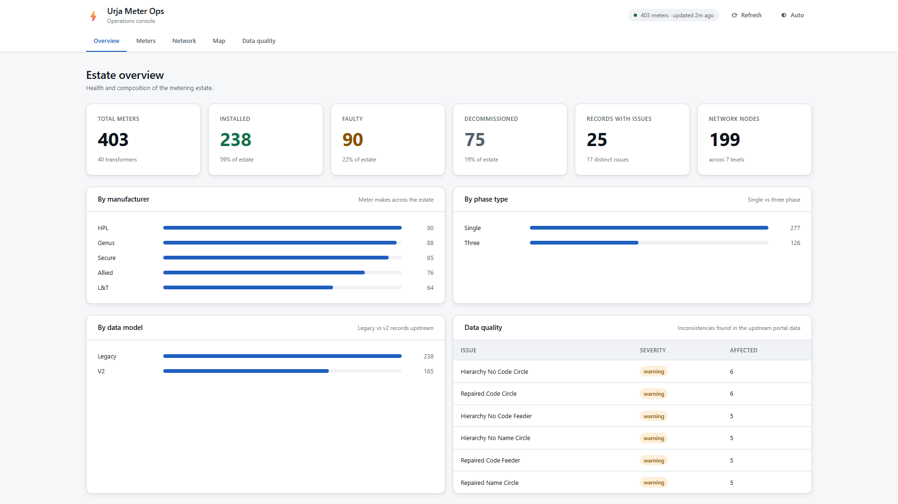
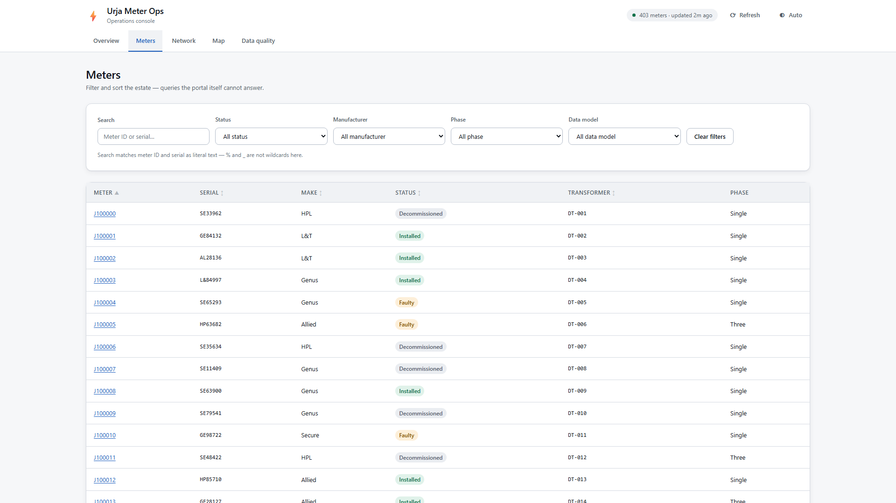
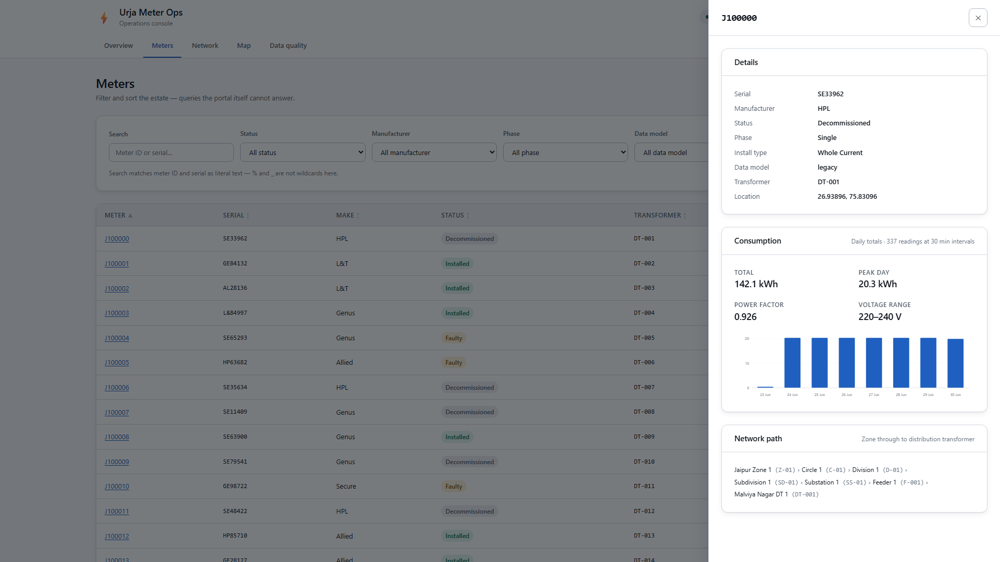
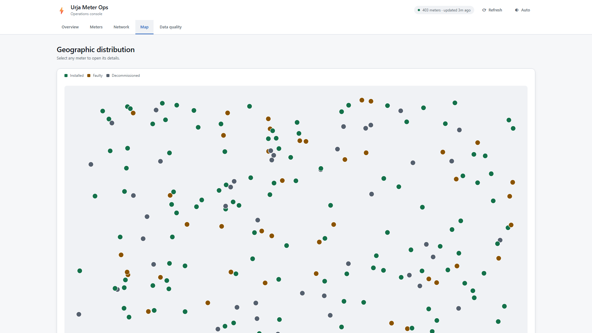
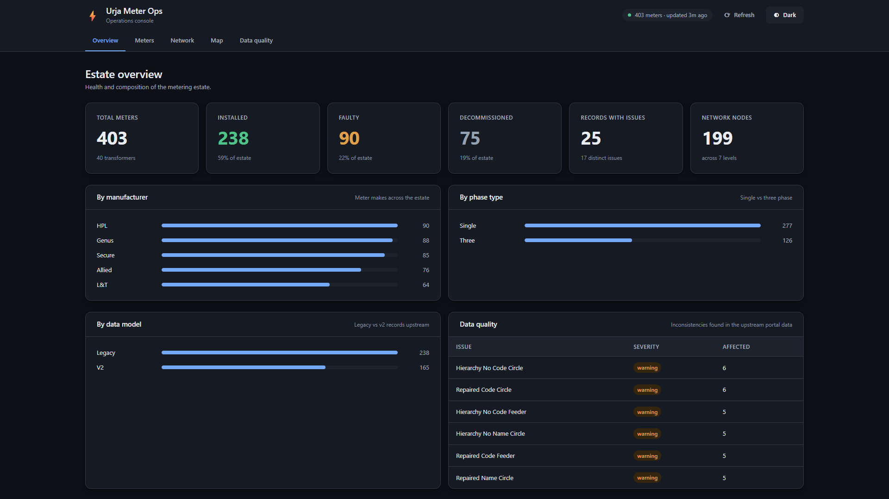
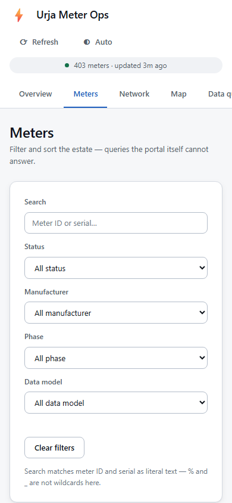

# Flock Energy — Urja Meter Ops API

A clean, documented REST API over the legacy **Urja Meter Ops** portal, which has no API of
its own.

The service logs into the portal as a normal user, manages the session, calls the internal
endpoints I reverse-engineered, normalises the portal's inconsistent payloads, and serves
the result as typed JSON that another program can consume without ever touching the portal.

| | |
|---|---|
| **How the portal works** | [`PROTOCOL.md`](PROTOCOL.md) — the reverse-engineering write-up |
| **API specification** | [`openapi.json`](openapi.json) (OpenAPI 3.1, generated from code) |
| **Interactive docs** | `/docs` (Swagger UI) and `/redoc` once running |
| **Reflection** | [`REFLECTION.md`](REFLECTION.md) |
| **Design records** | [`docs/adr/`](docs/adr/) |
| **Operations** | [`docs/RUNBOOK.md`](docs/RUNBOOK.md) — deploy, health semantics, failure modes |
| **Web console** | `/app` once running — meters, hierarchy, consumption, map, data quality |
| **Walkthrough** | [`docs/walkthrough/`](docs/walkthrough/) — full video + [coverage report](docs/walkthrough/COVERAGE.md) |

---

## Screenshots

A continuous video walkthrough over **403 real meters** lives at
[`docs/walkthrough/walkthrough.mp4`](docs/walkthrough/walkthrough.mp4) (1920×1080); the
[coverage report](docs/walkthrough/COVERAGE.md) maps every view, state and API call. A few stills:

| | |
|:---:|:---:|
|  |  |
| Estate overview — 403 meters, health & composition | Meters — filter, sort, search, paginate |
|  |  |
| Meter detail + live consumption chart | Geographic distribution by status |
|  |  |
| Dark theme | Responsive at 390 px |

---

## Quickstart

Requires Python 3.11+.

```bash
git clone <this-repo> && cd flock-energy-api

python -m venv .venv && source .venv/bin/activate    # Windows: .venv\Scripts\activate
pip install -r requirements.txt      # or: pip install -r requirements.lock (hash-pinned)

cp .env.example .env        # then fill in PORTAL_USERNAME / PORTAL_PASSWORD

uvicorn app.main:app --reload
```

Open <http://127.0.0.1:8000/> in a browser and it redirects to the operations console at
`/app/`; <http://127.0.0.1:8000/docs> serves the API documentation. The startup log prints
both paths. On startup the service
authenticates and pulls the whole meter estate — 403 meters and 40 transformers, in
about 600 ms.

<details>
<summary>Docker instead</summary>

```bash
cp .env.example .env    # fill in credentials
docker compose up --build
```
</details>

Any container host (Render, Fly.io, Cloud Run, ECS) runs the `Dockerfile` as-is and is the
recommended target. A Vercel serverless entrypoint (`api/index.py` + `vercel.json`) is also
included — see [`DEPLOY-VERCEL.md`](DEPLOY-VERCEL.md) for the steps and the stateless
trade-offs.

### Verify it works

```bash
curl -s localhost:8000/api/v1/health/live      # {"status":"alive",...}
curl -s localhost:8000/api/v1/system/snapshot  # meter_count: 403, source: "export"
```

---

## Sample request

```bash
curl -s 'localhost:8000/api/v1/meters?make=HPL&install_status=faulty&page_size=1'
```

```json
{
  "items": [
    {
      "meter_id": "J100018",
      "serial_no": "GE50943",
      "make": "HPL",
      "phase_type": "single",
      "install_status": "faulty",
      "dt_code": "DT-019",
      "location": { "latitude": 27.023530279896317, "longitude": 75.74833874320397 }
    }
  ],
  "meta": {
    "page": 1, "page_size": 1, "total_items": 23, "total_pages": 23,
    "has_next": true, "has_previous": false
  }
}
```

None of that query is possible against the portal: it cannot filter by make or status, and
never exposes coordinates in a listing.

<details>
<summary>More examples</summary>

```bash
# Real consumption, rolled up daily (the portal only shows raw register readings)
curl -s 'localhost:8000/api/v1/meters/J100001/consumption?granularity=daily'

# The reconstructed network tree, two levels deep
curl -s 'localhost:8000/api/v1/hierarchy?depth=2'

# Meters within 2 km of a point
curl -s 'localhost:8000/api/v1/meters/near?lat=26.9124&lng=75.7873&radius_km=2'

# Every inconsistency found in the upstream data
curl -s 'localhost:8000/api/v1/data-quality'

# Estate summary
curl -s 'localhost:8000/api/v1/stats'
```

Consumption response (abridged):

```json
{
  "meter_id": "J100001",
  "window_start": "2026-06-23T23:30:00",
  "window_end": "2026-06-30T23:30:00",
  "granularity": "daily",
  "summary": {
    "total_kwh": 138.8, "total_kvah": 149.9, "average_power_factor": 0.926,
    "peak_interval_kwh": 19.83, "min_voltage_r": 220.0, "max_voltage_r": 240.0,
    "interval_minutes": 30.0, "reading_count": 337, "gap_count": 0
  },
  "intervals": [
    { "start": "2026-06-24T00:00:00", "end": "2026-06-25T00:00:00",
      "duration_minutes": 1440.0, "kwh": 19.82, "kvah": 21.42,
      "average_voltage_r": 228.698, "estimated": false }
  ]
}
```
</details>

---

## What I built

### The three findings that shaped it

Everything below follows from what the portal turned out to be. Full evidence in
[`PROTOCOL.md`](PROTOCOL.md).

**1. There is a bulk export — and it's richer than anything else.**
`GET /portal/export` (HMAC-signed) returns **all 403 meters in one request**, including the
full hierarchy path and float coordinates that the paginated listing omits entirely. That
changed the architecture from "proxy each call through" to "hold a local snapshot and query
it", which is the only reason filtering, sorting, hierarchy and proximity search are
possible at all.

**2. `kwh`/`kvah` are cumulative registers, not usage.**
The values only ever increase — they're odometer readings. Summing them would report ~14
million kWh for a household. Consumption is the *difference* between consecutive readings,
so the API serves derived intervals rather than raw registers.

**3. Hierarchy codes are not globally unique.**
`D-01` appears under three different circles. Nodes are therefore identified by their full
ancestor path (`Z-01/C-01/D-01`), not by code — collapsing by code would merge unrelated
branches and corrupt every meter count above them.

### Architecture

```
       HTTP client
            │
┌───────────▼────────────┐
│  API layer             │  routing · validation · pagination · error contract
│  app/api/              │
├────────────────────────┤
│  Snapshot store        │  in-memory index · TTL freshness · filter/sort/geo queries
│  app/store/            │
├────────────────────────┤
│  Domain                │  canonical models · normalisation · hierarchy · consumption
│  app/domain/           │  ← pure, no I/O, no framework imports
├────────────────────────┤
│  Portal adapter        │  auth · session · HMAC signing · devalue · retries
│  app/portal/           │  ← the only layer that knows the portal exists
└───────────▲────────────┘
            │
   Urja Meter Ops portal
```

Dependencies point inward. The domain layer imports no HTTP library and no framework, so
its logic — which is where all the genuinely tricky reasoning lives — is testable without
a network or an app instance.

```
app/
├── main.py            Composition root, lifespan, exception handlers
├── config.py          Environment-driven settings
├── errors.py          Public error contract
├── logging_setup.py   Structured logs with request-scoped correlation IDs
├── portal/
│   ├── session.py     Login, expiry tracking, single-flight re-auth, 429 backoff
│   ├── client.py      Endpoint calls, retries, three-way expiry detection
│   ├── signing.py     HMAC-SHA256 request signing
│   ├── devalue.py     SvelteKit __data.json decoder
│   └── exceptions.py
├── domain/
│   ├── models.py      Canonical pydantic models
│   ├── normalize.py   Messy upstream payloads → canonical objects
│   ├── hierarchy.py   Tree reconstruction, blank repair, registry reconciliation
│   ├── consumption.py Register deltas, cadence inference, resampling
│   └── quality.py     Data-quality aggregation
├── store/snapshot.py  Snapshot lifecycle + query layer
└── api/v1/            meters · hierarchy · transformers · system
```

### Web console

`/app` is a small operations console over the same API: estate overview, filterable meter
table with detail drawer and consumption charts, the reconstructed network tree, a
geographic scatter, and the data-quality report. The meter table's filter, sort and page
state lives in the URL hash, so a filtered view is shareable and survives a reload.

Vanilla ES modules, no build step, no runtime dependencies — **19 KB gzipped total**. It is
served under a strict `default-src 'self'` CSP with no `unsafe-inline`, which is why styles
are applied through CSSOM rather than style attributes.

Verified in a real browser: 0 console errors, WCAG 2.2 AA contrast in both themes
(20 samples measured), full keyboard operation with a focus trap in the dialog, and no
horizontal overflow at 320/480/768/1024/1440/1920 or at 640×320 landscape.

### Endpoints

| Method | Path | Purpose |
|---|---|---|
| `GET` | `/api/v1/meters` | List with filters, sort, pagination |
| `GET` | `/api/v1/meters/{id}` | Full meter record incl. hierarchy path |
| `GET` | `/api/v1/meters/{id}/consumption` | Derived consumption, `raw`/`hourly`/`daily` |
| `GET` | `/api/v1/meters/near` | Proximity search |
| `GET` | `/api/v1/hierarchy` | Reconstructed network tree |
| `GET` | `/api/v1/hierarchy/nodes/{path}` | Subtree by path id |
| `GET` | `/api/v1/hierarchy/nodes/{path}/meters` | Meters beneath a node |
| `GET` | `/api/v1/transformers` | DT registry with live meter counts |
| `GET` | `/api/v1/transformers/{code}` · `/meters` | One DT, and its meters |
| `GET` | `/api/v1/data-quality` | Upstream inconsistencies, with counts |
| `GET` | `/api/v1/stats` | Estate summary |
| `GET` | `/api/v1/health/live` · `/health/ready` | Liveness · readiness |
| `GET` | `/api/v1/system/snapshot` · `/system/session` | Snapshot and session provenance |
| `POST` | `/api/v1/system/snapshot/refresh` | Force a rebuild (throttled: `429` + `Retry-After` inside the min interval) |

Every error uses one shape, so clients branch on `code` rather than parsing prose:

```json
{ "error": { "code": "not_found", "message": "No meter with id 'NOPE'.",
             "details": { "hint": "Meter ids are case-sensitive upstream." },
             "request_id": "7a6774a0558d4b57ac3510e1130d739a" } }
```

Portal faults map to `502`/`503`/`504` — never a bare `500`, and upstream HTML or stack
traces never reach the client. A caller can always distinguish "upstream is down" from
"this service is broken".

---

## Testing

```bash
make test          # 286 tests, no network required
make test-live     # 18 contract tests against the real portal (needs credentials)
```

`make test` — 286 tests, **91% coverage**, no network. Payload fixtures are **recorded from
the live portal**, not hand-written: invented fixtures only prove the code agrees with my
assumptions, recorded ones prove it agrees with the system it has to talk to.

`make test-live` — re-verifies every claim in `PROTOCOL.md` against the running portal:
the signing scheme and its ±300 s window, cumulative registers, both meter builds still
existing, the `LIKE` wildcard quirk, non-unique hierarchy codes. **Documentation that can
fail a build cannot silently rot.** These are excluded from CI, because a third party's
availability should never decide whether our build is green.

Tests are named as the property they protect, not the function they call — e.g.
`test_merging_by_code_would_have_been_wrong`, `test_consumption_is_the_delta_not_the_reading`.

`tests/test_end_to_end.py` closes the one seam unit tests structurally cannot: it mocks
**only** the portal's HTTP responses and drives the real app through `TestClient`, so
dependency wiring, lifespan ordering, session recovery, cross-layer error mapping and the
snapshot economics (many requests → one export; a refresh burst → one export) are all
exercised end to end.

Two real bugs were caught this way and are worth naming: the `{node_id:path}` route
converter silently swallowing `/meters` (see `app/api/v1/hierarchy.py`), and the snapshot
store downgrading a complete snapshot to a degraded one during an upstream failure.

---

## Assumptions

1. **Timestamps are naive local time.** The portal sends `DD/MM/YYYY HH:MM` with no
   timezone. The utility is in Jaipur, so IST is likely — but nothing states it, so I kept
   the values naive rather than stamping UTC on them and silently shifting every reading by
   5½ hours. Flagged as an open question rather than quietly decided.
2. **Day-first date parsing.** Not assumed — proven: series run to `30/06/2026`, and there
   is no month 30.
3. **The DT registry is authoritative for DT names.** Where a meter's DT name disagrees
   with `/portal/dts` (`DT-007` has a stale alias on three meters), the registry wins and
   the conflict is reported.
4. **Registers are monotonic; a decrease means rollover or meter replacement.** Not observed
   in this dataset, but physical meters do wrap. A negative delta yields `null`, not a
   negative consumption that would corrupt any downstream sum.
5. **A ~5 minute staleness window is acceptable.** Meter attributes and hierarchy change on
   the order of weeks. Every response carries `X-Snapshot-Age-Seconds` so a caller can apply
   a stricter policy; consumption is always fetched live.
6. **Hierarchy codes are scoped to their parent** rather than globally unique. The data
   cannot settle this, so I chose the lossless reading — see ADR-0003.
7. **The portal is read-only** and reachable from wherever this runs.

## Design decisions & trade-offs

| Decision | Why | Trade-off accepted |
|---|---|---|
| **Snapshot the estate, don't proxy** | One signed export returns all 403 meters with hierarchy + geo. Proxying would inherit every portal limitation and add a hop. | Up to `TTL` seconds of staleness; memory grows with estate size. |
| **In-memory, not a database** | 403 meters ≈ 400 KB. Postgres+PostGIS would add a container, migrations and ops burden to a service whose entire dataset fits in a rounding error of RAM. | Cold start on restart; no cross-instance sharing. See *Scaling*. |
| **Proactive *and* reactive re-auth** | `expiresAt` lets us refresh before expiry; reactive retry covers clock drift and server-side revocation. Either alone is a gamble. | Slightly more code than a naive retry-on-401. |
| **Single-flight session refresh** | Login is rate limited (4th attempt → `429`). N concurrent expiries must produce one login. | A lock on the auth path. |
| **Search locally, not upstream** | The portal's `q` is an unescaped SQL `LIKE` — `_` matches all 403 meters. | We can't use any server-side index; irrelevant at this size. |
| **Path-based hierarchy identity** | Codes are not globally unique; keying by code merges unrelated branches. | Node ids are longer; callers must treat them as opaque. |
| **Expose data quality** | Hiding upstream mess is how downstream teams end up debugging *our* service. | Admits the data is imperfect — correctly. |
| **Repair only unambiguous blanks** | Filling a blank with one candidate is inference; with two it's fabrication. | Some blanks remain — reported, not hidden. |
| **Serve stale on refresh failure** | Stale data with an honest age beats a 503. | Callers must read `X-Snapshot-Age-Seconds` if freshness is critical. |
| **Generate `openapi.json` from code** | A hand-written spec drifts. CI fails if the committed file is stale. | Spec shape is bounded by what FastAPI emits. |

## What I intentionally left out

* **Authentication on our own API.** It's an internal service in this exercise, and a
  half-built auth model is worse than an explicitly absent one. `POST /system/snapshot/refresh`
  is unauthenticated and should sit behind auth + per-client rate limiting before real
  deployment. Because each rebuild costs one portal export, it already coalesces forced
  refreshes to one per `SNAPSHOT_REFRESH_MIN_INTERVAL_SECONDS` (returning `429` +
  `Retry-After` inside that window) so it cannot be used to amplify load on the legacy
  portal — but that is a blast-radius guard, not a substitute for auth.
* **A persistent datastore.** Unjustifiable at 403 records; see *Scaling* for the threshold.
* **Prometheus metrics.** Structured logs with request IDs and timings carry the same
  information for a service this size; wiring an exporter would be ceremony.
* **A frontend framework and build step.** The console at `/app` is ~19 KB gzipped of
  vanilla ES modules with zero runtime dependencies. React plus a bundler would add a
  toolchain, a lockfile and ~45 KB for five views and a drawer.
* **A tiled basemap.** The map view plots true relative geography as an SVG scatter. A
  real basemap needs an external tile provider, which this service should not depend on
  and the console's `default-src 'self'` CSP forbids.
* **Crawling per-meter detail to enrich the snapshot.** The export already contains a
  superset, so the snapshot's degraded fallback is the paginated *search* crawl, not this.
  The per-meter SSR detail adapter (`get_meter_detail`) is implemented and unit-tested as a
  reusable capability, but it is deliberately not on any live request path.
* **Retry on `POST`.** There are no upstream writes, so retry-safety questions don't arise.

## What I'd do next

1. **Resolve the timezone** with whoever owns the portal, then make timestamps
   timezone-aware. Currently the largest correctness risk in the whole service.
2. **Incremental refresh.** Rebuilding all 403 records to observe a handful of changes is
   fine now and wasteful at scale; the export offers no delta mechanism, so this needs a
   change-detection strategy.
3. **Shared cache (Redis) + persistent snapshot**, so restarts are warm and instances agree.
4. **Anomaly detection** on the consumption series — zero-consumption runs on `Installed`
   meters, voltage excursions, flatlined registers. The data supports it and it's what an
   operations team would actually ask for next.
5. **A hierarchy explorer UI**, once the API surface has settled.
6. **Contract tests in CI** against a recorded cassette, so upstream drift is caught on a
   schedule rather than by a human running `make test-live`.

## Scaling

Honest limits of the current design, since the brief asks where it starts to struggle:

| Estate size | Behaviour |
|---|---|
| **~400 (today)** | Snapshot ≈ 400 KB, builds in ~600 ms, queries well under 1 ms. Comfortable. |
| **~50,000** | Snapshot ≈ 50 MB; still fine. Linear filter scans reach ~10 ms — noticeable, not painful. Proximity search wants a spatial index (R-tree / geohash). |
| **~500,000** | Full in-memory rebuild becomes untenable: multi-hundred-MB working set, slow cold starts, and every instance holding a duplicate copy. Move to Postgres + PostGIS with incremental sync, keep only hot data in memory, and page the hierarchy rather than serving whole trees. |

The first thing to break is not memory but the **full rebuild**: it is O(estate) on a timer,
so refresh cost grows while the change rate does not. Incremental sync is the fix, and it's
blocked on the portal offering a delta or change-timestamp — which it currently does not.

---

## Configuration

All settings are environment variables; see [`.env.example`](.env.example). Credentials have
no defaults, so a missing credential fails loudly instead of producing a service that 401s
on every request.

| Variable | Default | Purpose |
|---|---|---|
| `PORTAL_USERNAME` / `PORTAL_PASSWORD` | *(required)* | Portal credentials |
| `PORTAL_BASE_URL` | `https://urja-ops.flockenergy.tech` | Upstream base URL |
| `SNAPSHOT_TTL_SECONDS` | `300` | Snapshot freshness window |
| `SNAPSHOT_REFRESH_MIN_INTERVAL_SECONDS` | `30` | Min spacing between forced refreshes (`0` disables) |
| `CONSUMPTION_CACHE_TTL_SECONDS` | `120` | Per-meter series cache |
| `SESSION_REFRESH_MARGIN_SECONDS` | `120` | Refresh this long before expiry |
| `PORTAL_MAX_CONCURRENCY` | `6` | Ceiling on concurrent upstream requests |
| `PORTAL_MAX_RETRIES` | `3` | Retries for timeouts and 5xx |
| `LOG_FORMAT` | `json` | `json` in production, `console` locally |

`.env.example` documents all 25 settings. `requirements.txt` pins direct dependencies;
`requirements.lock` additionally pins every transitive dependency with sha256 hashes, and the
Docker image builds from it with `--require-hashes`, so a compromised or yanked transitive
release fails the build rather than shipping.

**Secrets:** `.env` is git-ignored, credentials are held as pydantic `SecretStr`, and login
failures never echo the request body. The portal's HMAC signing secret is fetched at runtime
and never written to disk or logs.

## Development

```bash
make dev        # install dev dependencies
make test       # tests + coverage
make lint       # ruff check + format check
make fmt        # auto-format
make openapi    # regenerate openapi.json
make docker     # build the image
```

CI (GitHub Actions) runs lint, tests on Python 3.11 and 3.12 with an 80% coverage floor,
verifies `openapi.json` is not stale, and builds the Docker image.
